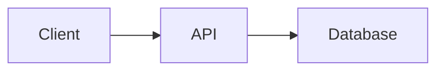
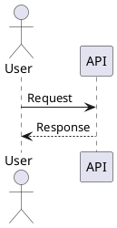

# Technical Diagrams

Select the simplest engine that expresses the requested system accurately, then return a fenced Markdown block with an explicit language tag so CodyWeb can render it.

## Select the engine

- Use Mermaid for flowcharts, lightweight sequences, state diagrams, ER diagrams, Git graphs, journeys, and simple architecture overviews.
- Use PlantUML for detailed sequences, class/object diagrams, component/deployment diagrams, C4 views, complex UML relationships, or when precise UML notation matters.
- Prefer Mermaid when both engines are equally clear.
- Do not represent a diagram with ASCII art unless the user explicitly requests plain text.

## Produce Mermaid

Use exactly this structure:

````markdown

````

Keep node labels concise. Quote labels containing punctuation. Give edges meaningful labels when the relationship is not obvious.

## Produce PlantUML

Use `plantuml` or `puml` as the fence language and include boundaries:

````markdown

````

Keep diagrams self-contained. Standard-library includes such as `!include <C4/C4_Container>` are allowed. Do not use filesystem includes, `!includeurl`, `!import`, or remote themes because CodyWeb renders PlantUML locally and blocks external access.

## Quality check

Before returning the diagram:

1. Verify every node and relationship comes from the available evidence or is clearly marked as an assumption.
2. Avoid crossing edges and excessive nodes; split into multiple focused diagrams when one view becomes dense.
3. Use a consistent direction and vocabulary.
4. Add one short sentence before the diagram explaining what the view shows.
5. Keep the fenced source valid and editable; never replace it with a generated bitmap.
