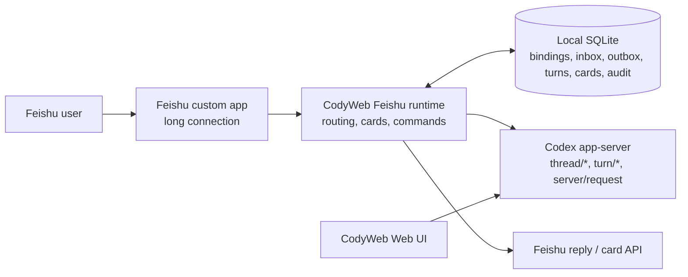

# Feishu bot integration

Feishu is a first-class CodyWeb client. It lets a person choose a visible
CodyWeb project, attach a Feishu conversation to an existing Codex Session or
create one, then continue the **same Codex thread** from Feishu and the Web UI.
It is not a notification-only bot and it does not maintain a parallel transcript.

This document distinguishes implemented behaviour from completion gates. A
parser or test helper is not a production capability until the long-connection
runtime actually calls it.

## Product target and hard boundary

The completed product offers one or more Feishu bots as safe, durable remote
clients for the local CodyWeb service. A private chat, a flat group, and each
group topic can independently choose a project and Session. A person can move
between Feishu and the browser without losing context, approvals, or turn state.



`app-server` is the sole execution boundary. Feishu reuses CodyWeb's
`thread/*`, `turn/*`, notification, and server-request paths; it never creates
a second Codex CLI process, PTY, tmux/zellij session, Worker, or separate
transcript. botmux is a reference for mature Feishu transport and interaction
patterns, not the runtime we embed. See [the comparison matrix](FEISHU_BOTMUX_AUDIT.md).

## User experience

An unbound conversation works as follows:

1. In a private chat, send a message. In a group, @mention the bot according
   to the bot's group-trigger policy.
2. CodyWeb stores that opening message durably and presents only visible
   projects.
3. Choose a project, then choose a recent Session or **New session**.
4. The selection creates or updates a binding and submits the retained message
   to that exact Codex thread.
5. The browser can open the same thread immediately; subsequent Web and
   Feishu messages share one transcript and one approval request.

`/unbind` removes the Feishu relationship only. It never deletes or archives a
Codex thread. Deleting a bot likewise removes its Feishu data and bindings but
preserves all shared Codex Sessions.

### Conversation scopes and group safety

Each binding is namespaced by bot id and has one of these scopes:

| Scope | Binding identity | Meaning |
| --- | --- | --- |
| Private topic (default) | bot + private chat + top-level message | Each top-level direct message starts a Feishu topic and gets its own Session binding. Replies in that topic reuse it. |
| Flat private chat | bot + private chat | Optional continuous mode where the whole direct-message conversation shares one Session binding. |
| Flat group | bot + group chat | One group-wide Session. |
| Topic | bot + group + root/topic | Each topic gets its own Session. |

The runtime identifies a top-level group message's real chat mode before
binding it. If that lookup fails, it fails closed rather than accidentally
placing a topic message into a flat-group Session. Messages authored by apps or
bots are ignored, as are messages aimed at another mentioned user.

Every bot also chooses one `p2pMode`. The default `topic` mode matches
botmux: a top-level private message is answered with `reply_in_thread=true`,
which creates a Feishu topic rooted at that message; messages carrying both
`root_id` and `thread_id` continue the same project and CodyWeb Session. A
quoted message that only carries `root_id` is not mistaken for a topic reply.
The optional `chat` mode keeps the legacy flat behaviour and reuses one binding
for the entire private chat. Existing flat bindings remain available when a bot
is switched back to `chat` mode.

Every bot chooses one `groupMentionMode`; the default is the safest option:

| Mode | Behaviour |
| --- | --- |
| `always` (default) | Every group or topic message must @mention the bot. |
| `topic` | A bound topic may continue without an @mention; flat groups still require one. |
| `bound` | Any bound group or topic may continue without an @mention. This has the highest noise and accidental-action risk. |

An unbound group always needs an @mention. An allow-list of Feishu `open_id`s
is also available per bot. An empty allow-list blocks everyone by default.
Broad access is represented separately by `allowAllUsers=true`, and the UI
requires explicit acknowledgement before saving that higher-risk policy.

When a person outside that identity allow-list explicitly @mentions the bot in
an allowed group (or messages it directly), CodyWeb does not silently discard
the request. It privately sends the bot administrator—the first configured
allow-list member—a signed approval card and tells the requester to wait. An
approval atomically adds only that exact `open_id`; it never enables broad
access. The requester can then retry and use the same group/topic Session.
Ambient unmentioned group messages and messages from a group outside
`allowedChatIds` never create an access request. Ambiguous messages that also
mention another user/app stay silent. Approval tokens are signed, expire after
seven days, and cannot be edited to grant a different identity.

## Multiple bots and management

**Settings → Feishu bots** manages multiple independent custom apps. Each has
its own App ID/secret, enabled state, identity allow-list, group policy,
connection health, bindings, inbox/outbox records, and audit trail. App secrets
are write-only: browser/API DTOs only reveal whether a secret is configured.
Secrets in SQLite and the reusable Open Platform Web session are encrypted with
AES-256-GCM. CodyWeb creates a private `credentials.key` beside the settings
store, or operators can provide `CODY_WEB_UI_CREDENTIAL_KEY` /
`CODY_WEB_UI_CREDENTIAL_KEY_FILE` so the encryption key is managed separately.
Existing plaintext bot secrets are encrypted during the first database read.

The authenticated management API and UI can:

- create, update, enable/disable, reconnect, and delete a bot;
- list and remove conversation bindings without touching Sessions;
- inspect persistent setup/recovery jobs and adopt an already-created app;
- choose local-only deletion or first disable the remote bot capability;
- run a live diagnostic that independently checks local credentials, enablement,
  the in-process runtime, the event long connection, a real Feishu credential
  API call, and bot-identity consistency; and
- display connection state, safe recent failures, and delivery/turn/card/audit
  counts without returning prompts, message payloads, Open IDs, or secrets;
- manually return a scheduled failure or dead letter to the same bot's durable
  delivery queue, with a fresh bounded retry budget and a management audit row.

Adding a bot defaults to Feishu's official one-click device flow exposed by the
Node SDK `registerApp`. CodyWeb renders the official verification URL as a QR
code. The Feishu/Lark confirmation page shows the scanning account, enterprise,
application information, least-privilege scopes, `im.message.receive_v1`, and
`card.action.trigger`; `createOnly=true` prevents accidentally selecting and
overwriting an existing app. Because that official page already performs the
account/enterprise confirmation, CodyWeb does not ask for a misleading second
confirmation after the app has been created.

The returned App Secret goes directly into encrypted write-only local storage
and is never returned in the setup job or browser API. CodyWeb then uses public
Open APIs to enable the bot, force event and callback delivery to WebSocket,
publish and enable a version, and read back scopes, subscriptions, version,
visibility, bot ability, and bot identity. A failed post-creation configuration
keeps the local bot disabled and offers an in-place retry using the same saved
App ID/Secret, avoiding a second scan and a duplicate app. Private Web-console
automation, cached-session adoption, and manual App ID/Secret entry remain
compatibility/recovery paths, not the normal onboarding path.

Application availability and CodyWeb authorization are deliberately separate:

- **Feishu availability** controls who can discover/contact the application in
  Feishu. QR setup offers creator only, explicit member Open IDs, or the whole
  enterprise. Whole-enterprise availability requires confirmation.
- **Specified group chats** are a CodyWeb runtime allow-list of Feishu chat
  IDs (`oc_...`). They are not sent to Open Platform as organization user-group
  availability. In this mode the app remains creator-only at the platform layer,
  and non-listed chat IDs are rejected before the inbound event is claimed.
- **CodyWeb access** controls whose messages may operate projects and Sessions.
  The QR creator is added automatically. An empty allow-list denies everyone;
  `allowAllUsers` is a separate, explicitly confirmed broad-access switch. A
  denied user's explicit request can be approved privately by the first
  allow-listed administrator, granting only the signed requesting `open_id`.

Publishing an app to a broad Feishu audience therefore never silently grants
them CodyWeb access.

## SQLite state, ordering, and recovery

SQLite stores integration control-plane state, not a duplicate Codex transcript:

- bot configuration and long-connection state;
- bindings, permitted identities, and original messages awaiting selection;
- claimed inbound events and their outcome;
- leased outbound deliveries, retry attempts, remote message ids, and
  dead-letter status;
- Feishu-origin turn state, stream cards, card versions, and server-request
  presentations; and
- redacted operational audit facts.

Incoming events are claimed by a stable event/message id before they can cause
side effects. Outbound operations get a persistent Feishu `uuid`, derived from
their durable operation identity, so a process crash after remote success does
not create a second remote message on retry. Card updates carry increasing
versions; a stale stream delta cannot overwrite a terminal result.

The opening message is not deleted when a project or Session button is
clicked. It remains in SQLite until its durable Feishu turn has been prepared.
New-Session creation also records an intent and the catalog snapshot first; if
the process exits around `thread/start`, a retry can recover the newly visible
Session instead of silently losing the prompt or creating another one. A
pending message is drained at startup only when its persisted selection intent
matches the committed binding; a picker that is still waiting for the user is
left untouched instead of being sent to an older binding.
Mutually exclusive Session buttons share one in-process lock and one SQLite
lease, so different options cannot consume the same opening message concurrently.

For a shared Codex thread, Feishu turns are FIFO. If a Web-origin or Feishu
turn is active, the new Feishu message remains durable and queued; the next one
starts only after a terminal app-server notification. On startup the runtime
restores queued/running Feishu turns, asks the app-server for authoritative
turn state when possible, reconciles the card, and then drains the queue.

Delivery is leased and survives process restart. Network, timeout, rate-limit,
and server failures retry with bounded exponential backoff. Known permanent
Feishu/HTTP 4xx failures are dead-lettered; unknown failures are abandoned
after ten attempts. Diagnostics distinguish scheduled retries from terminal
dead letters. An operator can choose **Retry now** without creating a second
outbox operation; bot-scoped lookup prevents a guessed delivery id from being
replayed through another bot, and stale card versions are discarded before
remote update. Disabling/deleting a bot closes its connection and rejects
only live waiters—it does not touch Codex threads.

Default operational retention is intentionally finite:

| Data | Default retention |
| --- | --- |
| Project/session-selection pending messages | 24 hours |
| Completed inbound event records | 7 days |
| Sent outbox entries and terminal turn/card state | 30 days |
| Audit records and dead letters | 90 days |

Cleanup runs at service start and daily. It never deletes queued, running,
sending, or processing work. `CODY_FEISHU_*_RETENTION_DAYS` overrides the
corresponding policies.

## Responses, requests, and commands

One stream card represents each Feishu-origin Codex turn. It moves through
queued, running, completed, failed, and stopped states, linking to the browser
Session when `CODY_PUBLIC_URL` is configured. Terminal cards are frozen and
late updates are ignored.

App-server approvals and `item/tool/requestUserInput` are presented as
interactive cards. In groups, these sensitive cards are delivered privately to
the binding owner when the Feishu transport supports private user cards. The
callback uses the verified Feishu operator identity; it does **not** trust
identity fields carried in card action values. A request resolved in the Web UI
also freezes its Feishu card. Pending request ownership is persisted and
revalidated after restart. Option answers are selected directly in the card.
Questions that permit free text show an `/answer <requestId> <questionId>
<answer>` command, so they do not force a switch back to the browser. Sensitive
free-text answers are accepted only in a private chat, submitted immediately,
and replaced with `[REDACTED]` before card state is persisted or rendered.

The supported commands are:

| Command | Effect |
| --- | --- |
| `/help` | Show the compact command card. |
| `/project` | Start project/Session selection again. |
| `/sessions` | Show Session choices for the bound project. |
| `/switch <number\|threadId\|title>` | Bind an existing Session directly. |
| `/new` | Create and bind a Session in the current project. |
| `/status` | Show bound project/Session, running/queued state, and browser link. |
| `/mode plan\|default` | Persist the Codex collaboration mode for this Feishu binding. Plan mode enables real `request_user_input` cards. |
| `/stop` | Interrupt the active turn for this Session, including a turn started from the Web UI. |
| `/answer <requestId> <questionId> <answer>` | Supply a permitted custom answer; sensitive answers require private chat. |
| `/rename <name>` | Rename the bound Session. |
| `/archive` | Archive the bound Session and remove this binding. |
| `/unbind` | Remove only this Feishu binding. |

Binding-management commands require the binding owner or a configured bot
administrator. Unknown slash commands are answered locally and are never sent
to Codex as a prompt.

## Incoming messages and files

The production event parser handles text, post/rich text, images, files,
audio, media, stickers, interactive cards, merge-forward shells, mentions,
quote hints, and user-DSL card wrappers. It strips only the configured bot's
mention—whether Feishu represents it as `open_id` or `app_id`—and retains
meaningful other mentions.

Images and normal file/audio/media resources are downloaded by the resource
endpoint to `~/.cody-web-ui/feishu-attachments` before the turn starts. Images
are supplied as local image inputs; other attachments appear as local absolute
paths in the prompt. Downloads stream instead of buffering in memory, have a
100 MB per-resource cap, sanitized names, private directories/files, and
fail-closed symlink handling. Cleanup defaults to 7 days and 2 GB; tune it via
`CODY_FEISHU_ATTACHMENT_RETENTION_DAYS`,
`CODY_FEISHU_ATTACHMENT_MAX_TOTAL_BYTES`, and
`CODY_FEISHU_ATTACHMENT_CLEANUP_INTERVAL_MS`.

The platform cannot download stickers, card-embedded resources (Feishu error
`234043`), or merge-forward child resources via this endpoint. The text still
reaches Codex and the prompt includes an explicit failure note rather than
silently omitting the asset.

### REST rich-message completion

Before routing a live event, the SDK transport calls a bounded
`im.message.get` resolver. It recovers `nonsupport` message bodies, unions the
two interactive-card representations, expands merge-forward content with a
bounded depth, and adds a bounded quoted-message view. Quoted interactive cards
use both REST representations, and quoted merge-forwards use the same bounded
expansion without recursively following more quotes. If REST completion is
unavailable (for example cross-tenant access, deletion, or missing permission),
the event body still proceeds and the unavailable quote is made explicit in the
prompt. This preserves delivery while avoiding a false claim of full recovery.

Resource handling described above remains limited by the Feishu resource API;
completion of a message body does not make stickers, card resources, or
merge-forward child resources downloadable.

## Feishu Open Platform setup

The default path is **Settings → Feishu bots → QR setup**. Enter a bot name,
keep the safe group trigger default, generate the QR code, then scan and confirm
the account, enterprise, app information, permissions, event, and callback on
Feishu's official page. The device flow may create either a Feishu domestic or
Lark international app and returns the platform brand together with the scanner
Open ID. CodyWeb stores that scanner as the default administrator.

The setup job and every completed stage are persisted in SQLite. The creation
screen exposes a proof matrix instead of collapsing the process into a generic
spinner. It records encrypted credential storage, account/tenant identity,
bot ability, effective scopes, message event and card callback subscriptions,
both WebSocket modes, online version, visibility, application enablement, SDK
connection, bot identity, and a fresh six-check OpenAPI/runtime probe. A service
restart restores this matrix and continues from the saved App ID rather than
forgetting which guarantees were already established.

“Created” is shown only when every proof is true. The final connection step runs
the same live diagnostic available on the management page; merely observing a
connected process or receiving a successful configuration response is not
sufficient. If a readback or live probe fails, the job stays failed/retryable,
preserves the exact failed evidence, and never claims that the bot is ready.

If setup stops:

1. Open **Setup and recovery history** and inspect the exact failed stage.
2. Choose **Continue** to retry from the persisted app/configuration stage. The
   job reuses the saved App ID and does not create another application.
3. If the app exists but the job can no longer continue, enter its exact
   `cli_...` App ID and choose **Scan to adopt**. The official page targets that
   existing app and cannot create a replacement. For legacy discovery, a cached
   Web login can still list manageable apps before starting the same official
   adoption flow.
4. If a public Open API or legacy private console contract changed, apply the
   specific missing scope, event/callback mode, or published-version repair in
   Open Platform, then retry.
5. Clear an expired legacy Open Platform authorization and scan again. This clears only
   the encrypted Web login cookie; it does not delete bots or Sessions.
6. Use manual App ID/Secret mode only when automatic creation/adoption cannot be
   repaired.

The primary QR path uses the official OAuth 2.0 Device Authorization Grant and
public application APIs. The legacy adoption path still automates Feishu's Web
console and may need adaptation if its private `/developers/v1/*` contract
changes. Both paths fail closed, keep partially configured apps disabled, and
offer retry/manual fallback instead of claiming a broken bot is ready.

The official flow distinguishes **Feishu domestic** from **Lark international**
using `tenant_brand`. REST clients and SDK long connections are constructed with
the matching domain, and the platform value participates in runtime
reconciliation. Manual entry requires the operator to select the platform that
issued the App ID and Secret; the API rejects missing or unknown platform values
instead of trying credentials against both domains.

For manual fallback, create a Feishu custom application, enable its bot
capability, and grant the permissions below. Feishu's permission page is
authoritative: tenants may surface an aggregate scope and/or require narrower
scopes separately.

| Permission | Purpose |
| --- | --- |
| `tenant:tenant:readonly` | Bind the app to the verified tenant immediately after official QR registration. |
| `application:application:patch` | Configure the app's bot ability, WebSocket modes, permissions, and visibility. |
| `application:application:self_manage` | Publish, enable, and read back the app's own configuration. |
| `application:bot.basic_info:read` | Verify the bot identity before enabling the local runtime. |
| `im:message` | Send, reply to, and update bot messages/cards. |
| `im:message.p2p_msg:readonly` | Receive private-chat messages. |
| `im:message.group_at_msg:readonly` | Receive group @mentions. |
| `im:message.group_at_msg.include_bot:readonly` | Receive messages that mention this and other bots. |
| `im:message:readonly` | Read message metadata for REST message completion. |
| `im:resource` | Download image/file/audio/video resources. |
| `im:chat:read` | Determine flat versus topic group routing. |
| `im:message:send_as_bot` | Send as the application bot. |

Under **Events and Callbacks**:

1. Select **Receive events through a long connection**.
2. Subscribe to `im.message.receive_v1`.
3. Subscribe to callback `card.action.trigger` (it is listed as a callback,
   not an ordinary event).
4. Publish a version whose availability includes the intended people/groups.

Long connection requires no public callback URL, verification token, or encrypt
key. Keep CodyWeb running while validating events. Card callbacks must return
quickly; CodyWeb acknowledges long work then finishes it asynchronously.

Useful official references:

- [Official one-click app creation](https://open.feishu.cn/document/mcp_open_tools/integrating-agents-with-feishu/overview)
- [Node SDK `registerApp`](https://github.com/larksuite/node-sdk/blob/main/README.zh.md)
- [Long-connection event subscription](https://open.feishu.cn/document/server-docs/event-subscription-guide/event-subscription-configure-/request-url-configuration-case)
- [Card callback communication](https://open.feishu.cn/document/feishu-cards/card-callback-communication?lang=zh-CN)
- [Message/resource API](https://open.feishu.cn/document/server-docs/im-v1/message/get-2)

## Deployment

Add the bot under **Settings → Feishu bots**. QR setup is the default and enables
the bot only after the critical event/callback configuration has been read back.
The manual App ID/Secret path creates bots disabled by default; explicitly
configure access policy before enabling.

For service deployments, set `CODY_WEB_UI_CREDENTIAL_KEY` from the host secret
manager (or point `CODY_WEB_UI_CREDENTIAL_KEY_FILE` at a root-owned mounted
secret). Back up that key separately: encrypted bot credentials and Web session
cookies cannot be recovered without it.

Use the normal CodyWeb deployment command and supply an externally reachable,
authenticated browser origin to enable **Open in CodyWeb** buttons:

```bash
CODY_PUBLIC_URL=https://cody.example.internal npm run deploy
```

`CODY_PUBLIC_URL` only builds browser links. It does not replace CodyWeb's
password, network controls, HTTPS, or firewall. For a non-loopback listener,
terminate TLS at CodyWeb or a trusted reverse proxy, set a strong
`CODY_PASSWORD`; use HTTPS whenever the network is shared or untrusted. Run the
service as the same OS user that owns
Codex configuration and target workspaces. The default settings directory is
mode `0700` and its SQLite DB is mode `0600`; protect custom database parents,
backups, and SQLite WAL/SHM files too.

Like botmux's local dashboard, CodyWeb allows authenticated Feishu management
over HTTP instead of blocking the workflow. The settings page shows a persistent
warning on remote plain-HTTP origins, CodyWeb login protection still applies,
and App Secrets are persisted server-side. This is a usability fallback for
trusted networks, not transport encryption; use a trusted HTTPS reverse proxy
on shared or untrusted networks.

The deploy script starts Node in a new session and disconnects standard input,
so it survives the invoking SSH/Codex shell. It also compares the running
service's `buildId` with a content hash of every tracked and untracked source
file, rather than trusting Git SHA alone. Check the exact build after deployment
with:

```bash
curl http://127.0.0.1:3000/codex-api/meta/version
```

The service launcher also imports standard proxy variables from the user's
login shell when a non-interactive deployment did not provide them. This is
important for Feishu-bound Sessions because the Feishu long connection can be
healthy while the colocated Codex app-server is unable to reach its upstream.
Use `CODY_IMPORT_LOGIN_PROXY_ENV=0` to opt out, or provide the proxy variables
explicitly when starting the service.

After deployment, open the selected bot and choose **Run live diagnostic**.
“Live connectivity verified” means all six checks passed in that invocation;
the passive delivery/turn/card counters alone are not connectivity proof.

Before starting the real-tenant acceptance matrix, collect a versioned,
redacted preflight record:

```bash
CODY_FEISHU_ACCEPTANCE_PASSWORD='replace-me' \
  npm run acceptance:feishu:preflight -- \
  --base-url https://cody.example.internal \
  --bot-id <bot-id> \
  --output .cody-runtime/acceptance/feishu/preflight.json
```

The command logs in without placing the password in the process arguments,
records the public build ID, requires a completed QR setup proof matrix, runs a
fresh six-check connectivity diagnostic, and saves only management-safe counts
and identifiers. Evidence files are mode `0600`. Remote HTTP is rejected unless
`--allow-http` is supplied explicitly for a trusted network; the evidence still
records the unencrypted protocol and server security risk IDs. A passing
preflight does **not** mark the integration complete: it prints the remaining
interactive tenant gates for chat, authorization, attachments, retries, and
restart recovery.

When deleting a bot, choose one option explicitly:

- **Delete CodyWeb configuration only** leaves the remote app unchanged so it
  can be adopted again.
- **Disable the remote bot, then delete locally** first proves that the cached
  Open Platform account can manage the app, disables its bot capability, and
  only then removes local state. If the remote operation fails, local config and
  bindings are retained.

Neither option deletes the shared Codex Sessions.

## Troubleshooting

| Symptom | Checks |
| --- | --- |
| Bot is disconnected | Verify App ID/secret, published version, service egress to Feishu HTTPS/WebSocket, and Settings diagnostics. |
| Live diagnostic fails at credential API | App ID/Secret may be invalid, rotated, or attached to a different platform. Update the write-only secret and rerun. |
| Live diagnostic passes credentials but fails long connection | Check egress/WebSocket policy, event long-connection mode, service logs, then reconnect and rerun. |
| Live identity does not match | Stop the bot and verify that the stored credentials belong to the intended app before replacing them. |
| Private chat works but group does not | Grant group-at permission, @mention the bot, and confirm the configured mention mode. |
| A topic appears in the wrong Session | Check `im:chat:read`; routing deliberately rejects a group message when mode lookup fails. |
| A button appears to do nothing | Subscribe to `card.action.trigger` as a long-connection callback, then inspect safe delivery/card diagnostics. |
| Open-in-Web button is absent | Configure `CODY_PUBLIC_URL`, redeploy, and use an authenticated public origin. |
| Attachments only show a failure note | Grant `im:resource`, check the 100 MB limit, then check whether the type is a platform-restricted sticker/card/merge-forward child. |
| A reply is duplicated after restart | Check outbox diagnostics. Stable inbound claims and Feishu `uuid` are designed to make retries idempotent. |
| A failed delivery stopped retrying | Open **Health diagnostics → Recent failed deliveries** and choose **Retry now** after correcting the underlying permission/network problem. |
| A message waits behind Web work | This is expected: it is stored FIFO until the shared Codex thread becomes terminal. Use `/status`. |

## Completion gates

The following evidence is required before calling the integration fully
production-complete:

- [x] Multi-bot, private/flat-group/topic binding, group mention modes, project
  selection, existing/new Session selection, and shared app-server thread flow.
- [x] Durable FIFO turn/card lifecycle, Web-origin busy detection, restart
  reconciliation, streamed cards, approval/request-user-input cards, commands,
  diagnostics, idempotent outbox, retries/dead letters, and attachment storage
  limits/cleanup.
- [x] Persistent one-scan setup stages and proof matrix, creator-safe defaults, explicit
  account/enterprise confirmation, availability/access expansion, existing-app
  adoption, encrypted credentials, precise local/remote deletion, and active
  six-check connectivity diagnosis required before setup completion.
- [ ] Run a real Feishu tenant smoke test against the exact permissions/events:
  - scan-create, publish, readback, long-connection identity, and live probe;
  - restart during setup and continue without creating another application;
  - private chat selecting an existing Session and creating a new Session;
  - flat group and topic bindings, including @mention and authorization rules;
  - simultaneous Web/Feishu use of one Session, streaming card, and `/stop` for
    turns started from either client;
  - approval and request-user-input cards, including unauthorized operators;
  - image, file, audio/video, quote, card, and merge-forward completion;
  - network outage, rate limiting, scheduled retry, dead letter, and manual
    requeue after recovery;
  - duplicate inbound events and duplicate card clicks;
  - missing permissions, expired legacy login state, allow-list escalation,
    cross-user/cross-chat attempts, disable/delete, and existing-app adoption.

Until the unchecked gates are complete, use the integration as an integrated
feature with clear operational limits—not as a substitute for a real-tenant
acceptance test.
